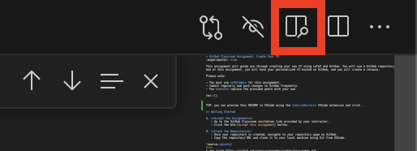

= GitHub Classroom Assignment: Create Your CV
:experimental: true

This assignment will guide you through creating your own CV using LaTeX and GitHub. You will use a GitHub repository template with a pre-configured `simplehipstercv.cls` file. By the end of this assignment, you will have your personalized CV hosted on GitHub, and you will create a release.

Please note:

- You must use **VSCode** for this assignment.
- Commit regularly and push changes to GitHub frequently.
- You **must** replace the provided photo with your own.

toc::[]

TIP: you can preview this README in VSCode using the **AsciiDoctor** VSCode extension and click the preview button on the top right of the VSCode window once the extension is installed . The extension is automatically recommended when you open the project in VSCode.

== Getting Started

1. **Accept the Assignment**: 
   - Go to the GitHub Classroom invitation link provided by your instructor.
   - Click the btn:[Accept this assignment] button.

2. **Clone the Repository**:
   - Once your repository is created, navigate to your repository page on GitHub.
   - Copy the repository URL and clone it to your local machine using Git from VSCode.

[source,console]
----
$ git clone https://github.com/<your-username>/<repository-name>.git
----

Replace the URL with the proper one.

3. **Open the Project in VSCode**:

- Open VSCode on your machine.
- From the `File` menu, click btn:[Open Folder], and select the folder of the cloned repository.

[source,console]
----
$ code <repository-name>
----

You should see the following files:

- `main.tex`: This is the main LaTeX file you will modify.
- `simplehipstercv.cls` and `simplehipstercv.sty`: These are the LaTeX class and style files that define the layout.
- Several image files: You **must** replace the `jack.jpg` image with your own.

== Modifying Your CV

1. **Open the `main.tex` file in VSCode**:
   - In the Explorer panel in VSCode, open `main.tex`.

2. **Update Your Personal Information**:
   Modify the following sections in `main.tex` to reflect your own information:
   - Name
   - Title
   - Contact information
   - Degrees and Certifications
   - Skills, Programming Languages
   - Work Experience
   - Languages
   - Any other sections that apply to your CV.

3. **Replace the Profile Photo**:
   - Replace the image `jack.jpg` in the project directory with your own photo, making sure it’s named exactly the same (e.g., `jack.jpg`).
   - Ensure your photo is in a supported format like `.jpg`, `.jpeg`, or `.png`.
   - Update the LaTeX command in `main.tex` to use the new photo (if the filename changes):

[source]
----
\includegraphics[width=1.1\linewidth]{jack.jpg} % Ensure your image is named 'jack.jpg'
----

== Committing and Pushing Your Changes

You must commit changes regularly to track your progress. Aim to commit after each significant modification to your CV (e.g., after updating a section or adding a photo).

1. **Stage and Commit**:
   After making changes, stage the changes and commit them using VSCode's built-in Git tools or from the terminal.

- In VSCode, go to the `Source Control` view (click the `Source Control` icon on the sidebar).
- Stage your changes by clicking the `+` next to each file.
- Write a meaningful commit message in the input box (e.g., "Updated CV details" or "Added profile picture").

Alternatively, you can use the terminal in VSCode:

[source,console]
----
$ git add .
$ git commit -m "Updated personal information"
----

2. **Push Changes to GitHub**:
   Push your committed changes to the remote repository on GitHub. You should do this frequently to back up your work.

In VSCode, go to the `Source Control` panel and click btn:[Push].

Alternatively, from the terminal:

[source,console]
----
$ git push origin main
----

== Preview Your CV

To ensure your CV is correctly formatted, you can compile the LaTeX file into a PDF. VSCode has LaTeX plugins, such as **LaTeX Workshop**, that can compile the document directly.

https://marketplace.visualstudio.com/items?itemName=James-Yu.latex-workshop[> Install **LaTeX Workshop**] from the VSCode extension marketplace and then compile the `main.tex` file by opening the Command Palette (btn:[Ctrl+Shift+P] or btn:[Cmd+Shift+P] on macOS) and typing `LaTeX Workshop: Build LaTeX project`.

TIP: **LaTeX Workshop** is a VSCode extension will be automatically recommended for installation when you open the project in VSCode.

Alternatively, compile it using the terminal:

[source,console]
----
$ pdflatex main.tex
----

Check the output PDF and ensure everything looks correct.

== Regular Commits and Progress

Throughout this assignment, you are expected to:

- Commit **after every major change** (e.g., after updating your photo, updating work experience, or modifying the structure).
- Push your changes to GitHub regularly to ensure your repository is always up to date.

== Create a Release

Once you’re satisfied with your CV, you will create a release on GitHub. A release allows you to package your final PDF version of your CV for download.

1. **Generate the Final PDF**:
   Compile your `main.tex` into a final PDF.

2. **Go to Your Repository on GitHub**:
   - Navigate to your GitHub repository.

3. **Create a New Release**:
   - Click the btn:[Releases] tab.
   - Click btn:[Draft a new release].

4. **Fill in the Release Information**:
   - Tag the release (e.g., `v1.0`).
   - Give it a title (e.g., `Final CV Release`).
   - In the description, mention what you've updated or finalized.

5. **Attach the PDF**:
   - Upload your final CV PDF (e.g., `main.pdf`) as an asset for the release.

6. **Publish the Release**:
   - Click btn:[Publish release] to finalize it.

== Submission Instructions

Once your release is published, submit the release link to your instructor as your final deliverable.

== Troubleshooting

- **Latex Compilation Issues**: Ensure that all necessary LaTeX packages are installed. Check for missing packages in the error logs.
- **Git Issues**: If you encounter issues with Git commands or pushing, make sure you're authenticated correctly, or refer to Git's troubleshooting guides.
- **VSCode Extensions**: Make sure **LaTeX Workshop** and **Git** extensions are installed for easy integration with LaTeX and version control.

== Resources

- GitHub Docs: https://docs.github.com
- VSCode Docs: https://code.visualstudio.com/docs
- Overleaf LaTeX Editor (optional): https://www.overleaf.com
- LaTeX Wikibook: https://en.wikibooks.org/wiki/LaTeX
